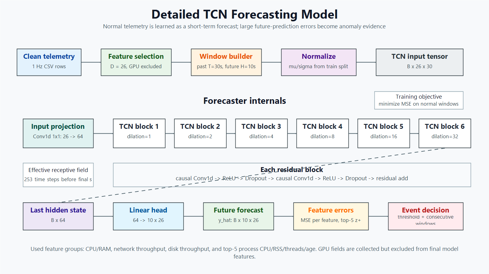
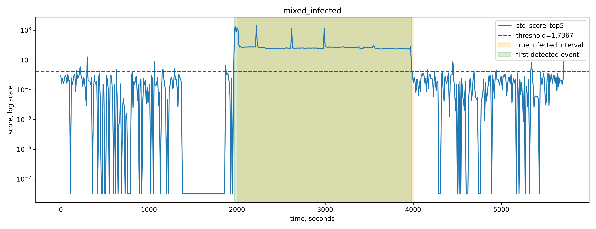
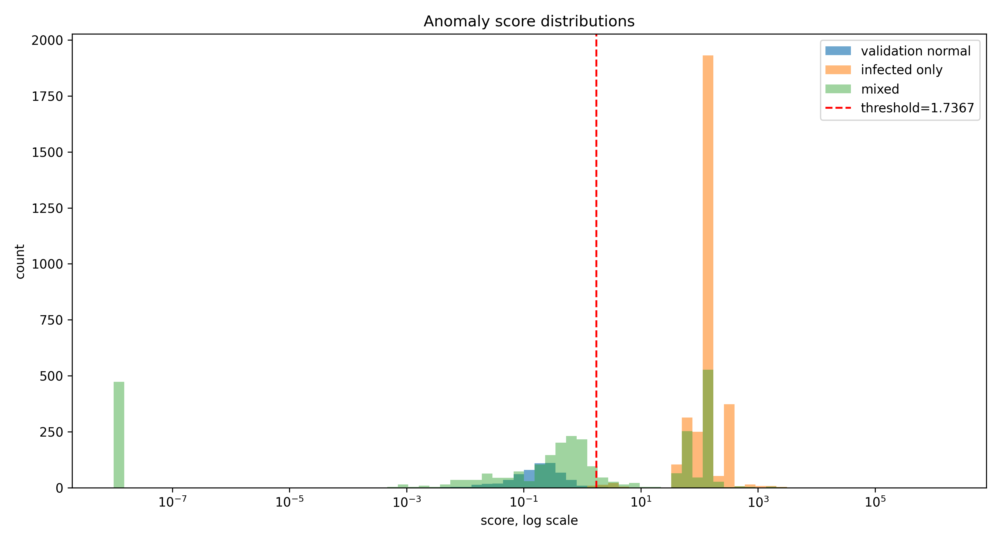

# TCN-Based Deep Learning Anomaly Detection for Telemetry Data

This repository contains a deep learning coursework project for anomaly detection in system telemetry time series. The main model is a Temporal Convolutional Network (TCN) trained as a forecasting model; anomalies are detected from normalized prediction errors.

## Highlights

- Deep learning pipeline for telemetry-based anomaly detection
- TCN forecaster for multivariate time-series modeling
- Prediction-error anomaly scoring with threshold-based event detection
- Evaluation on infected-only and mixed normal/infected telemetry scenarios
- Ablation studies for temporal window length and forecasting horizon
- Comparison with classical baselines: Isolation Forest and One-Class SVM

## Main Results

| Dataset | Precision | Recall | F1 | FPR |
| --- | ---: | ---: | ---: | ---: |
| Mixed scenarios | 1.0000 | 0.9754 | 0.9872 | 0.0000 |

Classical baseline comparison:

| Model | Precision | Recall | F1 | FPR |
| --- | ---: | ---: | ---: | ---: |
| TCN forecaster | 1.0000 | 0.9754 | 0.9872 | 0.0000 |
| Isolation Forest | 0.5778 | 0.5537 | 0.5468 | 0.1206 |
| One-Class SVM | 0.5391 | 0.9438 | 0.6858 | 0.4178 |

## Model Overview

The model is trained on normal telemetry windows and learns to forecast future telemetry values. During inference, a high forecasting error indicates behavior that differs from the learned normal profile.



## Detection Examples

Mixed telemetry scenarios combine normal behavior with infected intervals. The model assigns anomaly scores to temporal windows and raises detection events when scores exceed the selected threshold.





## Repository Structure

```text
.
|-- data_scripts/        # Data checks, preprocessing, and window construction
|-- model_scripts/       # TCN training and anomaly scoring scripts
|-- pipelines/           # End-to-end training and evaluation pipelines
|-- experiments/         # Ablations, baselines, and stress scenarios
|-- figures/report/      # Figures used in the final report
|-- results/tables/      # Final evaluation tables
|-- checkpoints/         # Trained model checkpoints and score files
|-- datasets/            # Prepared temporal window datasets
|-- coursework_final.tex # Final LaTeX coursework report
|-- refs.bib             # Bibliography
`-- project_config.py    # Shared project configuration
```

## Reproduce the Pipeline

Create a virtual environment and install dependencies:

```powershell
python -m venv venv
.\venv\Scripts\pip.exe install -r requirements.txt
```

Run the full training and reporting pipeline:

```powershell
.\venv\Scripts\python.exe pipelines\run_train_pipeline.py
```

Run evaluation and regenerate report artifacts without retraining:

```powershell
.\venv\Scripts\python.exe pipelines\run_eval_only.py
```

## Experiments

The repository includes several experiment groups:

| Experiment | Location |
| --- | --- |
| Temporal window ablation | `experiments/window_ablation/` |
| Forecast horizon ablation | `experiments/horizon_ablation/` |
| Threshold and event-rule tuning | `experiments/threshold_event_tuning/` |
| Classical baseline comparison | `experiments/classical_baselines/` |
| Stress mixed scenarios | `experiments/stress_mixed_scenarios/` |

## Report Artifacts

Key result tables are stored in `results/tables/`.

Key figures are stored in `figures/report/`.

The final coursework source is available in `coursework_final.tex`.

## Tech Stack

- Python
- PyTorch
- NumPy
- pandas
- scikit-learn
- Matplotlib
- LaTeX
